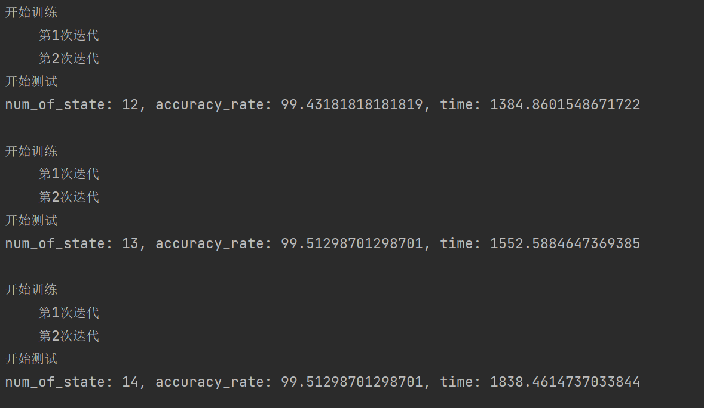
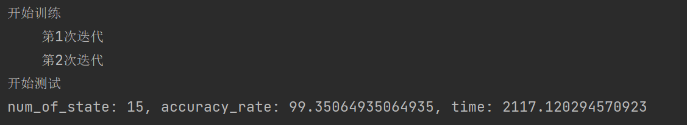
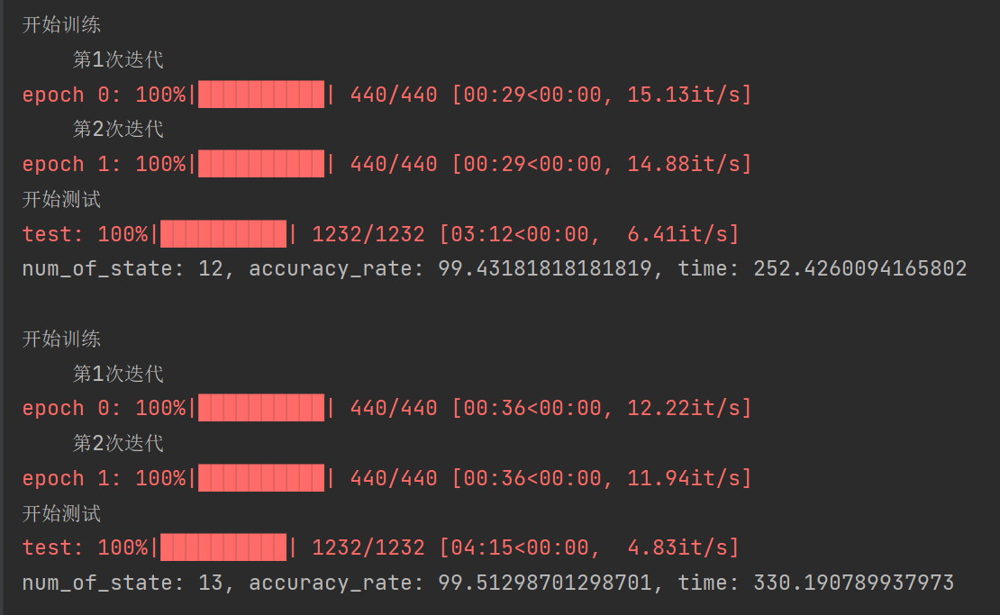
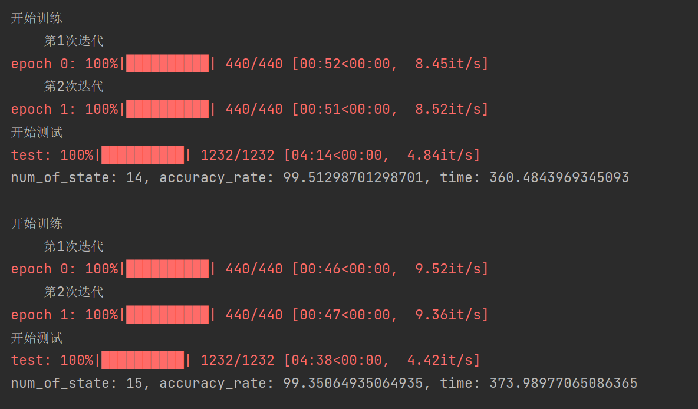
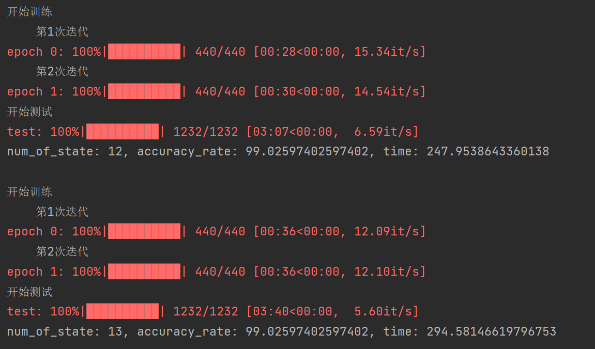
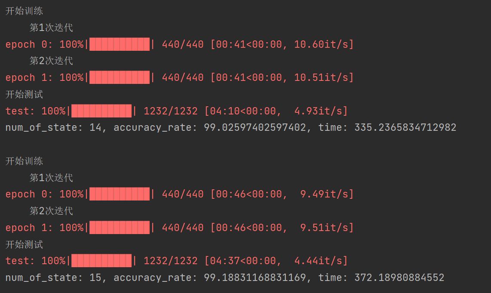

# 语音识别-HMM

<center><font size=5>1850061&nbsp;&nbsp;&nbsp;&nbsp;&nbsp;阮辰伟</font></center>


[toc]

<div style="page-break-after:always"></div>

## 1. 项目介绍

### 1.1 项目简介

本项目中通过HMM模型进行单词$['one','two','three','four','five','six','seven','eight','nine','zero','o']$​进行分类。经过优化与调试，识别的准确率可以达到***99%***以上。同时，我还用了***多进程技术***对模型的训练进行加速，经过加速后，模型的一次训练***仅耗时5分钟左右***。

### 1.2 开发环境

+ 开发环境：`Windows 10`

+ 开发软件：

  **PyCharm** *2021.1.2(专业版)*

+ 开发语言

  ``` Python 3.8.2```

### 1.3 运行方式

1. 进入根目录

2. 首先需要生成mfcc文件，可以选择通过**调用python接口**的方式以及**通过本人写的mfcc生成程序**这两种方式生成

   - 通过下述命令生成mfcc文件（调用python接口）

     ```shell
       python generate_mfcc_files.py
     ```

   - 通过下述命令生成mymfcc文件（本人写的mfcc生成程序）

     ```shell
       python generate_my_mfcc_files.py
     ```

3. 通过下述命令运行main.py文件，开始使用HMM模型进行语音识别的分类训练

```shell
  python main.py 
```

## 2. 主要函数

### 2.1 主函数

| API      | main.main                                                    |
| -------- | ------------------------------------------------------------ |
| **说明** | HMM模型训练以及测试的主函数。该函数会对不同显状态 个数下的隐马尔可夫模型进行训练并且测试其准确率。 |
| **参数** | 无                                                           |
| **返回** | 无                                                           |

### 2.2 文件生成模块

#### 2.2.1 调库生成mfcc文件

| API      | generate_mfcc_files.fwav2mfcc                                |
| -------- | ------------------------------------------------------------ |
| **说明** | 使用python库`python_speech_features.mfcc()`函数生成13维的mfcc特征矩阵，再通过`python_speech_features.base.delta()`对mfcc特征矩阵进行2次差分，最终使得特征向量的维度为 （$$39\times 帧数$$） |
| **参数** | infilename：输入源音频文件的路径                                                                                                                                                                             outfilename：音频处理完成后特征值的存储路径 |
| **返回** | 无                                                           |

#### 2.2.2 自己生成mfcc文件

| API      | generate_my_mfcc_files.generate_one_mfcc(inpath,  outpath)   |
| -------- | ------------------------------------------------------------ |
| **说明** | 自己写的mfcc特征提取函数。过程为：1. 分帧。 2. 预加重。 3. 汉明加窗。 4. 快速傅里叶变换。 5. 梅尔滤波。 6. 离散余弦变换。 7. 动态特征提取。 |
| **参数** | infilename：输入源音频文件的路径                                                                                                                                                                             outfilename：音频处理完成后特征值的存储路径 |
| **返回** | 无                                                           |

#### 2.2.3 生成测试列表

| API      | generate_mfcc_files.generate_testing_list                    |
| -------- | ------------------------------------------------------------ |
| **说明** | 把部分语音文件夹下的所有语音文件加入到测试文件列表中，并保存起来 |
| **参数** | list_filename： 测试文件列表的存储路径                       |
| **返回** | 无                                                           |

#### 2.2.4 生成训练列表

| API      | generate_mfcc_files.generate_trainting_list                  |
| -------- | ------------------------------------------------------------ |
| **说明** | 把部分语音文件夹下的所有语音文件加入到训练文件列表中，并保存起来 |
| **参数** | list_filename： 训练文件列表的存储路径                       |
| **返回** | 无                                                           |

#### 2.2.5 生成文件模块总程序

| API      | generate_mfcc_files.generate_mfcc_file                       |
| -------- | ------------------------------------------------------------ |
| **说明** | 该函数为mfcc文件生成的全过程。首先会通过gengrate_mfcc_samples()函数生成所有的mfcc文件。然后再通过generate_training_list()以及generate_testing_list()函数从这些mfcc文件中挑选出部分作为训练集以及数据集。最后，会统计文件生成全过程的总耗时。 |
| **参数** | 无                                                           |
| **返回** | 无                                                           |

### 2.3 HMM模型

本模块中，高斯函数结果，alpha，beta，likelihold等变量均取了对数，原因是此时这些量非常接近于0，直接使用浮点数可能会造成数据实真情况。

#### 2.3.1 初始化函数

| API      | model.HMM.EM_initialization_model                            |
| -------- | ------------------------------------------------------------ |
| **说明** | 对模型的平均值mean，方差var以及转移概率Aij做初始化操作。其中对于每个**模型M**，**显状态j**来说，mean取**所有帧**对应的mfcc的均值，var取**所有帧**对应的mfcc取平方后的均值。对于Aij来说，状态i到它本身的概率取0.4，到它下一个状态i+1的值取0.6，其余值均未0。 |
| **参数** | training_file_list_name:  语音文件训练集                                                                                                                                                                                                                         DIM: MFCC向量维度                                                                                                                                                                                                                                                      num_of_state:  模型显状态个数                                                                                                                                                                                                                 num_of_model: 模型个数 |
| **返回** | 无                                                           |

#### 2.3.2 对数高斯模型

| API      | model.HMM.logGaussian                                        |
| -------- | ------------------------------------------------------------ |
| **说明** | 给定**模型M**以及**模型状态j**的情况下，根据均值mean_i以及方差var_i求出此时出现o_i的概率。作为发射概率$M_{j}$ |
| **参数** | mean_i:  高斯函数的平均值向量                                                                                                                                                                                                                         var_i:  高斯函数的方差向量                                                                                                                                                                                                          o_i:  mfcc特征值向量，在这里表示高斯函数的变量X |
| **返回** | 发射概率的的对数log_b                                        |

高斯函数公式为
$$
b=\Sigma(\frac{1}{var\sqrt{2\pi}} e^{-\frac{1}{2}*(\frac{o-mean}{var})^2})
$$
两边同时取对数后，公式变为
$$
ln_b=-0.5\times(\Sigma(ln(var))+\Sigma(ln(2\pi))+(\frac{o-mean}{var})^2)
$$

#### 2.3.3 对数先验概率

| API      | model.HMM.log_sum_alpha                                      |
| -------- | ------------------------------------------------------------ |
| **说明** | 对于给定的**模型M**，求出**t**时刻**模型状态为j**的先验概率（的一部分） |
| **参数** | log_alpha_t:  t-1时刻的先验概率的对数                                                                                                                                                                                                                  aij_j:  各个状态向**状态j**（j为后一状态）转换的概率 |
| **返回** | 先验概率的值                                                 |

先验概率递推公式为
$$
\alpha_t^j=b_j(x_t)\Sigma(\alpha_{t-1}^ia_i^j)
$$
两边同时取对数后，公式变为
$$
ln(\alpha_t^j)=ln(b_j(x_t)) + ln(\Sigma(e^{ln(\alpha_{t-1}^i)+ln(a_i^j)}))
$$
把在式子中使用$ln(\alpha_{t-1}^i)$​​​的原因是要与输入参数相看齐

#### 2.3.4 对数后验概率

| API      | model.HMM.log_sum_beta                                       |
| -------- | ------------------------------------------------------------ |
| **说明** | 对于给定的**模型M**，求出**t**时刻**模型状态为j**的后验概率  |
| **参数** | mean:  平均值向量                                                                                                                                                                                                                         var:  方差向量                                                                                                                                                                                                          obs: t+1时刻的特征值向量                                                                                                                                                                               log_beta_t:  t+1时刻的后验概率的对数                                                                                                                                                                                                                  aij_i:  各个状态向**状态i**(i为前一状态)转换的概率 |
| **返回** | 后验概率的值                                                 |

先验概率递推公式为
$$
\beta_{t-1}^j=\Sigma(b_j(x_t)\beta_{t}^ia_j^i)
$$
两边同时取对数后，公式变为
$$
ln(\beta_{t-1}^j)=ln(\Sigma(e^{ln(b_j(x_t))+ln(\beta_{t}^i)ln(a_j^i)})
$$
把在式子中使用$ln(\beta_{j}^i)$​​​​的原因是要与输入参数相看齐

#### 2.3.5 Viterbi算法

| API      | model.HMM.viterbi_dist_FR                                    |
| -------- | ------------------------------------------------------------ |
| **说明** | 对于给定的**模型M**，以及某一个音频的mfcc特征向量文件，这个音频能对应这个模型的概率。采用Viterbi算法可以根据隐状态求出可能的最有可能的显状态序列。但此时我们并不需要这个序列，我们只需要知道这个显状态序列的出现的概率值，用于与给定的其他模型，如**M1**作比较。 |
| **参数** | mean:  平均值向量                                                                                                                                                                                                                         var:  方差向量                                                                                                                                                                                                                                                                                                                  obs:  新音频的特征向量矩阵                                                                                                                                                                                                                  aij:  状态转换的概率 |
| **返回** | 给定音频对应固定模型M的概率                                  |

先验概率递推公式为
$$
f_{t}^j=b_j(x_t)max(f_{t-1}^ia_j^i)
$$
两边同时取对数后，公式变为
$$
ln(f_{t}^j)=ln(b_j(x_t))+max(ln(f_{t-1}^i)+ln(a_j^i))
$$
把在式子中使用$ln(f_{j}^i)$​​​​​​的原因是方便计算

#### 2.3.6 HMM模型测试

| API      | model.HMM.HMMtesting                                         |
| -------- | ------------------------------------------------------------ |
| **说明** | 对于每一个测试文件，使用viterbi_dist_FR得出最有**可能的模型M**。把这个**模型M**与**真实模型M'**作比较，如果不一致则判断该文件预测错误，否则则判断预测正确。最后再遍历完所有测试文件后，给出HMM模型准确率 |
| **参数** | testing_file_list_name：测试文件列表                         |
| **返回** | HMM模型准确率                                                |

#### 2.3.7 HMM模型训练M-step

| API      | model.HMM.EM_HMM_FR                                          |
| -------- | ------------------------------------------------------------ |
| **说明** | 先通过给定信息，求出log_alpha，log_beta，log_gamma，log_Xi等重要矩阵。再通过这些值求出mean_numerator, var_numerator, aij_numerator, denominator等迭代量。 |
| **参数** | mean:  模型k的平均值向量矩阵                                                                                                                                                                                                                         var:  模型k的方差向量矩阵                                                                                                                                                                                                            obs: 某一个文件的特侦矩阵                                                                                                                                                                               k:  模型所所对应的id                                                                                                                                                                                                                  aij:  模型k的状态转换的概率 |
| **返回** | 这个文件的迭代值                                             |

下面给出部分所用到的公式：
$$
log\_gamma_t^j=log\_alpha^t_j+log\_beta_t^j-ln(\Sigma(e^{log\_alpha^t_j+log\_beta_t^j}))
$$

$$
log\_Xt^{(i,j)}=log\_alpha^i_t+ln(aij_i^j)+log\_beta_{t+1}^j+b_j(x_{t+1})-log_alpha_T^{N-1}
$$

#### 2.3.8 HMM模型训练

| API      | model.HMM.EM_HMMtraining                                     |
| -------- | ------------------------------------------------------------ |
| **说明** | 首先对mean，var，Aij等值进行模型初始化。然后在每次迭代中，遍历训练文件列表。对于每一个文件，都会使用EM_HMM_FR函数算出这个文件的平均值，方差，aij等值的迭代量。文件遍历结束后，把这些迭代量相加。最后根据这些迭代两跟新mean，var，Aij等重要信息。 |
| **参数** | training_file_list_name：训练文件列表                        |
| **返回** | 无                                                           |

## 3. 模型评估

各个参数的获取可以再模块五的**结果展示**中查看到。

### 3.1 准确率评估

本模型的训练仅进行了2次迭代，原因是经过两次迭代后模型的准确率即可达到99%以上。在此基础上，我尝试探索了显状态个数以及mfcc的实现方式对模型准确率的影响，结果如下表所示。

| 显状态数 | mfcc调库实现 | mfcc自己实现 |
| -------- | ------------ | ------------ |
| 12       | 99.432       | 99.026       |
| 13       | 99.513       | 99.026       |
| 14       | 99.513       | 99.026       |
| 15       | 99.351       | 99.188       |

可以发现，显状态的得个数以及mfcc的实现方式均会小幅度影响模型的准确率，但是影响并不大。

### 3.2 性能评估

本代码实现的HMM模型并未对矩阵运算做过多优化，而是存在着大量的for循环。这导致了模型的复杂度非常高，运行起来极其费事，运行完成总共需要**2小时左右**。

本程序中最耗时的循环为遍历mfcc文件并对该文件进行迭代的过程（ER算法或者是Viterbi算法）。而文件遍历的顺序并不会影响到迭代的结果，因此同时访问多个文件变成为了可能。基于这个想法，我通过**多进程技术**对程序进行提速，结果如下表所示。

| 显状态数 | 使用多进程前（s） | 使用多进程后（s） |
| -------- | ----------------- | ----------------- |
| 12       | 1384.86           | 252.43            |
| 13       | 1152.59           | 300.19            |
| 14       | 1838.46           | 360.48            |
| 15       | 2117.12           | 373.99            |
| **合计** | **114分钟**       | **22min**         |

可以发现，在使用多进程技术后，程序的运行速度成为了原来的5倍多。提升效果非常显著。

## 4. 不同方式生成的MFCC比较

### 4.1 准确率比较

 在3.1模块的准确率评估中，我比较了调用python库（`python_speech_features`）以及自己实现mfcc对模型准确率的影响。可以发现，调用python库的情况下模型的准确率会**略高**一点，但总的来说两种方式的区别并不大。

### 4.2 耗时比较

由于使用不同方式生成的MFCC特征值大小一致且文件train/test列表一致，因此并不会影响到模型训练以及测试的时间。

但是可能由于我的mfcc实现并未做好优化，因此在生成mfcc文件这一块，我写的mfcc文件会更加耗时。具体来说，**使用python调库方式**生成mfcc文件的全过程只**需要耗时10s**左右。而使用**自己写的程序**生成mfcc文件的全过程**需要耗时600s**左右，耗时数十倍有余，相比于前者来说效率非常低下。

## 5. 结果展示

### 5.1 使用多进程前，mfcc调库





可以发现，在时间方面。该模式下进行一次模型的训练+测试需要耗时20min到35min。而运行完所有的状态数样例（$num\_of\_state\ 12\ \widetilde\ \  15$​​）总共需要114min，接近两小时，非常耗时。

在准确率方面，模型仅经过两次迭代准确率即可高达99%以上。准确率会随着$num\_of\_state$的变化略微发生改变，但是影响不大。

### 5.2 使用多进程后，mfcc调库





可以发现，在时间方面。该模式下进行一次模型的训练+测试需要耗时4.2min到6.2min。而运行完所有的状态数样例（$num\_of\_state\ 12\ \widetilde\ \  15$）仅需22min不到。相比于没有使用多进程时的2小时而言大大加快了。

在准确率方面，可以发现模型的准确率与5.1所示一模一样。由此可见多进程的使用并不会影响到模型准确率。

### 5.3 使用多进程后，mfcc自己实现





在时间方面，使用不同方式生成的MFCC特征值大小一致且文件train/test列表一致，因此并不会影响到模型训练以及测试的时间。

在准确率方面，可以发现模型的准确率总是略微低于mfcc调库的情况，但是两个模型准确率只差不会超过0.5。
